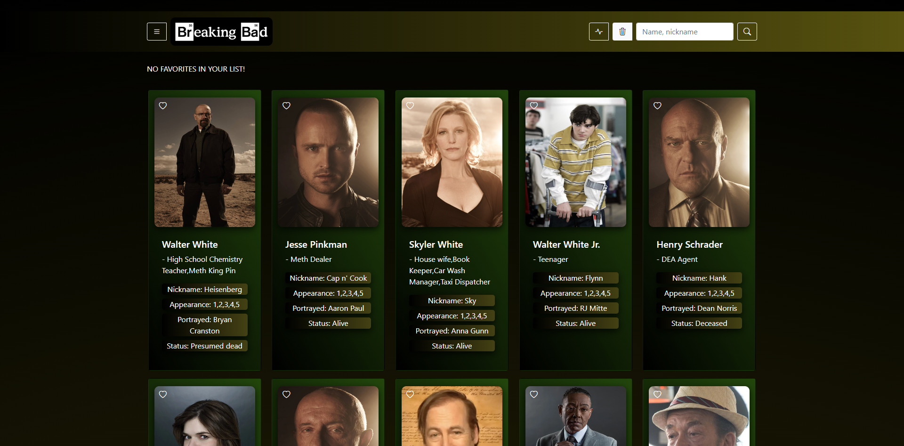
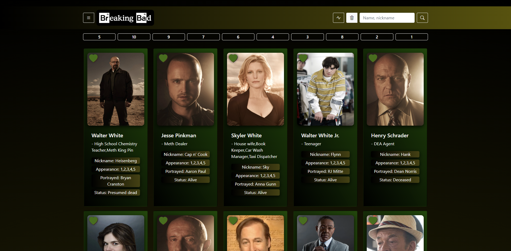
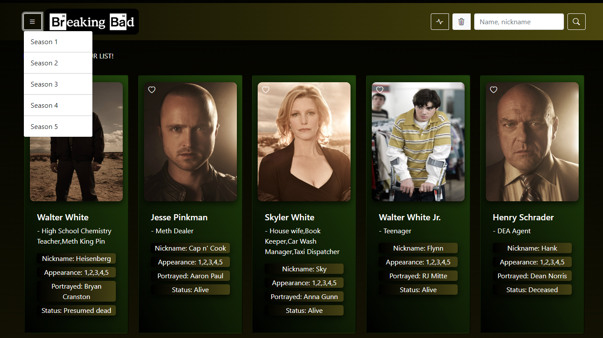
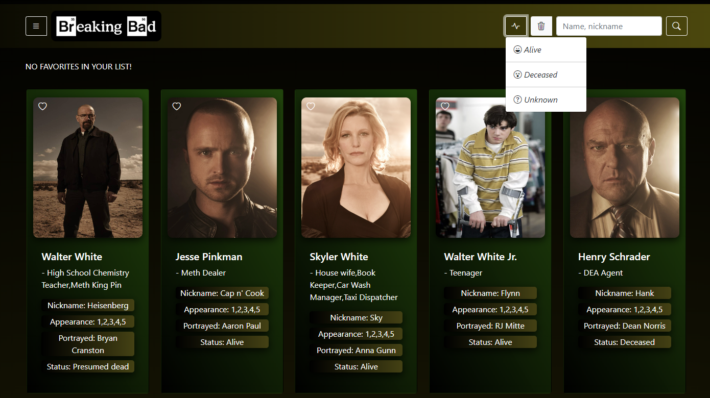
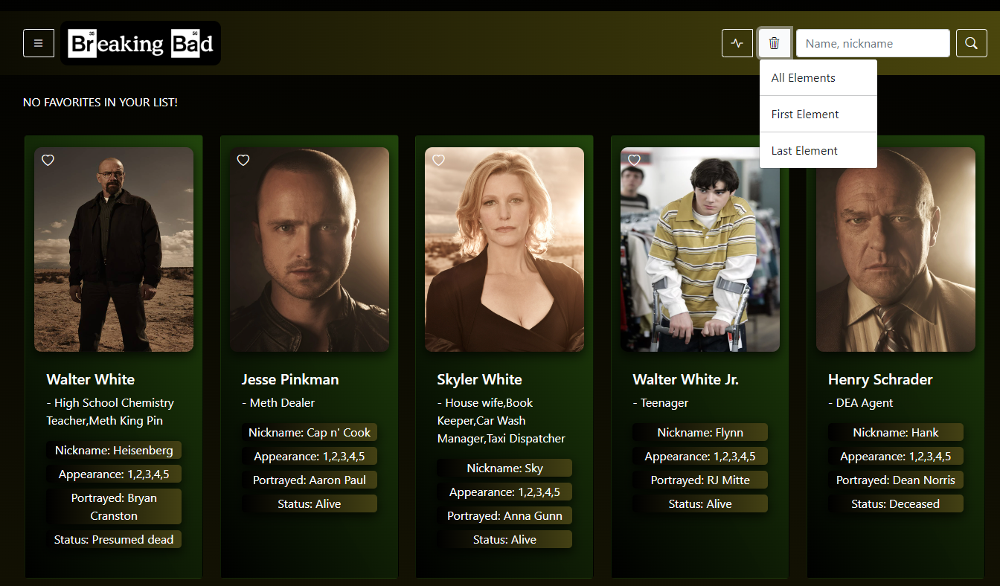

# Dev.f - Breaking Bad API

This is a solution to the project ✨ Breaking Bad ✨ of the [Computer Science](https://www.devf.la/master/encoding/mx).\
[Dev.f](https://www.devf.la/) offers an innovative solution to educational inclusion with EdTech programs that help people become software developers and obtain technological skills in order to obtain high-quality job opportunities in an agile and accessible way.

## Table of contents

- [Overview](#overview)
  - [The challenge](#the-challenge)
  - [How to use it](#how-to-use-it)
  - [Screenshot](#screenshot)
  - [Links](#links)
- [My process](#my-process)
  - [Built with](#built-with)
  - [Skills](#skills)
- [Author](#author)

## Overview

### The challenge

1. Create a page where you can consult the characters of Breaking-Bad
2. Read information about each character that is displayed.

Such as:
- Name
- Ocupation
- Nickname
- Appearance
- Portrayed
- Status

3. Have a favorites list with the characters that the user will choose by clicking on the cards.
    - Options to eliminate all the elements, the first element (**Stack**) of the list and the last element (**Queue**) (*Linear Data Structures*).

### How to use it

1. At first, displayed on the page you can see a navigation bar and also the full list of characters.

- The functioning of the navigation bar contains the following options:
    1. Dropdown to search characters by seasons (*1, 2, 3, 4, 5*)*
    2. Refresh the page (*by clicking on the Breaking-Bad logo*)
    3. Dropdown to search characters by status (*alive, deceased, unknown*)
    4. Dropdown to eliminate character(s) of the favorites list
        * All elements
        * First element (*stack*)
        * Last element (*Queue*)
    5. Search characters by name or nickname

2. By clicking on a character card, the heart icon on it will be colorized green as a sign that it has been introduced to the favorites list.
3. By clicking again on the character card, the heart icon on it will return at his initial state (uncolored) as a sign that it has been eliminated of the favorites list.

### Screenshot

1. **Entering the page**

2. **Cliking on the cards**

- *Search by seasons*

- *Search by status*

- *Eliminate characters of the favorites list*

### Links

- GitHub Repository: [breaking-bad-api-github](https://github.com/Alelsito/breaking-bad-api)
- Live Site URL(Netlify): [breaking-bad-consuming-api-netlify](https://breaking-bad-consuming-api.netlify.app/)
- Live Site URL(GitHub Pages)): [breaking-bad-api-github-pages](https://alelsito.github.io/breaking-bad-api/)

## My process

### Built with

- Semantic HTML5 markup
- JS
- CSS Grid
- [Bootstrap](https://getbootstrap.com/) - For styles
- [Bootstrap icons](https://icons.getbootstrap.com/) - For icons

### Skills

- APIs
- Fetch
- localStorage
- Linear Data Structures (stack & queue)
- Arrays Methods:
    * [reverse()](https://developer.mozilla.org/es/docs/Web/JavaScript/Reference/Global_Objects/Array/reverse)
    * [push()](https://developer.mozilla.org/es/docs/Web/JavaScript/Reference/Global_Objects/Array/push)
    * [pop()](https://developer.mozilla.org/es/docs/Web/JavaScript/Reference/Global_Objects/Array/pop)
    * [shift()](https://developer.mozilla.org/es/docs/Web/JavaScript/Reference/Global_Objects/Array/shift)
    * [splice()](https://developer.mozilla.org/es/docs/Web/JavaScript/Reference/Global_Objects/Array/splice)
    * [filter()](https://developer.mozilla.org/es/docs/Web/JavaScript/Reference/Global_Objects/Array/filter)
    * [includes()](https://developer.mozilla.org/es/docs/Web/JavaScript/Reference/Global_Objects/Array/includes)

## Author

- Github - [@Alelsito](https://github.com/Alelsito)
